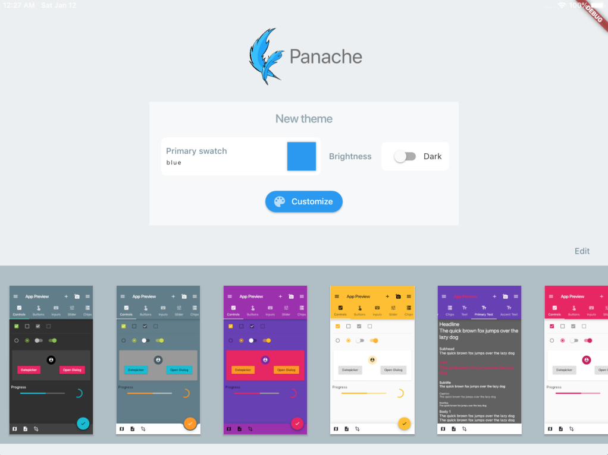
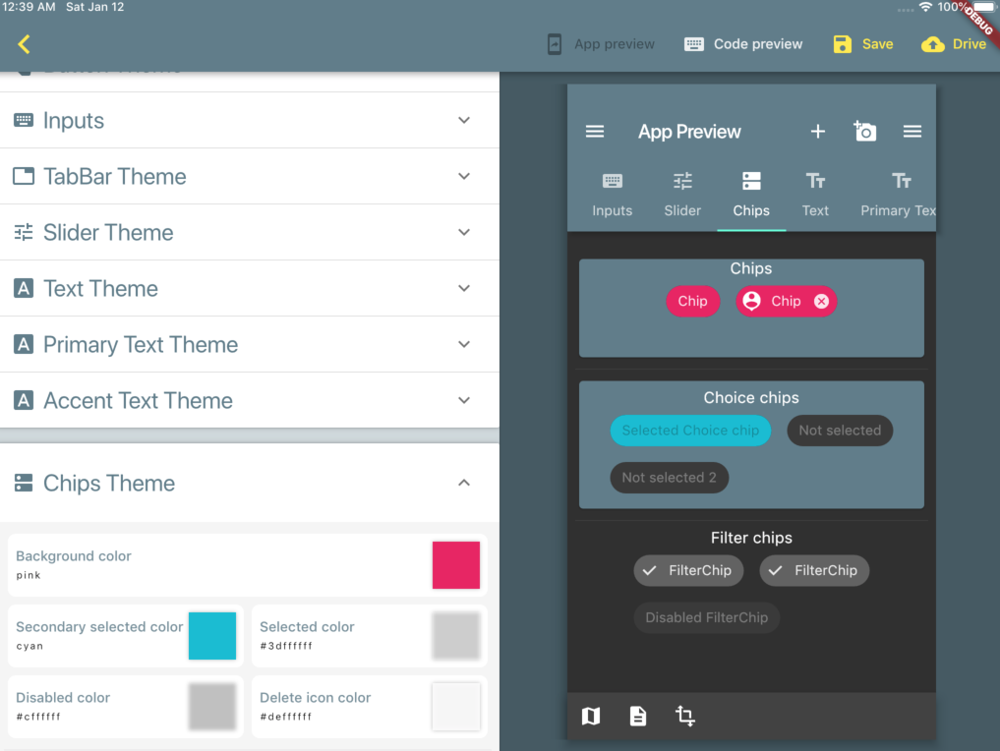
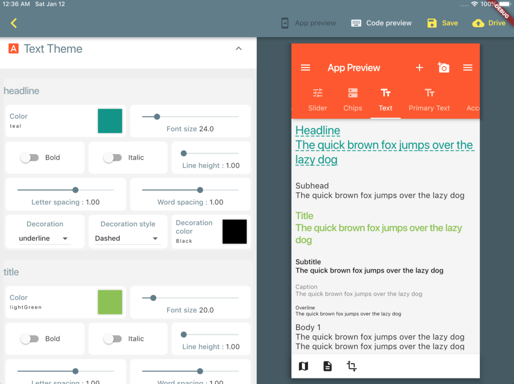
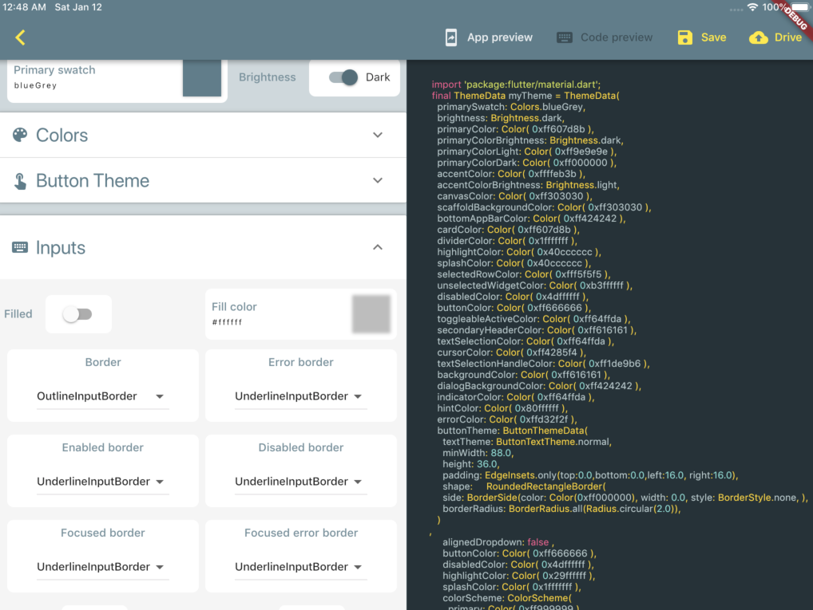

# Panache aka Flutterial 

[Try Panache in your browser](https://rxlabz.github.io/panache)

A [Flutter](https://flutter.io) [Material Theme](https://docs.flutter.io/flutter/material/ThemeData-class.html) editor. 

Panache helps you to create beautiful [Material](http://material.io) themes for your Flutter applications.
Customize components colors and shape, and export the generated theme.dart to your Google drive.

## Todo

- [x] web preview
- [x] web download generated theme
- [ ] partial export
- [ ] update to 1.9.+ theme
- [x] Theme editor / live app preview
- [x] Flutter 1.9+
- [x] Dart 2.5
- [ ] new Material Theme properties
  - [x] ButtonTheme
  - [x] ChipTheme
  - [x] TabBarTheme
  - [x] SliderTheme
  - [x] IconTheme
  - [x] DialogTheme
  - [x] InputDecorationTheme
  - [ ] [ColorScheme](https://github.com/rxlabz/color_scheme)
- [x] Code preview
- [x] Export to file
- [x] Save
- [x] Mobile : Export to Google drive
- [ ] material colors shades
- [ ] colors opacity
- more style options controls
  - [ ] BorderSide
  - [ ] BorderRadius
  - [x] typography options text styles : letter spacing, decoration...
- [ ] Examples
- [x] mobile version
- [x] desktop version
- [ ] user preferences :
  - [x] mobile editor scroll position
  - theme editor + preview last state
- [x] custom colorSwatch
- [ ] platform selection
- [ ] multiple fonts
- ...

## Getting Started

For help getting started with Flutter : [documentation](http://flutter.dev/).
