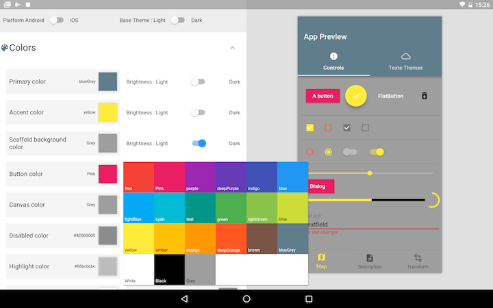
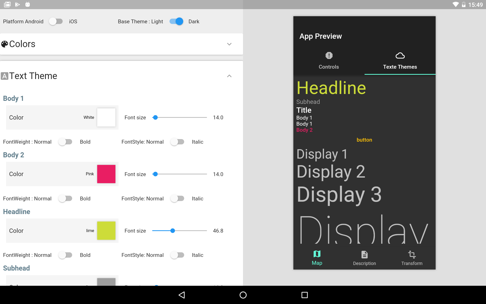

# Flutterial - WIP 

A [Flutter Material Theme](https://docs.flutter.io/flutter/material/ThemeData-class.html) explorer ( :warning: only tablet layout for now) 

## Material colors

## Text Theme

## Todo

- [x] Theme editor / live app preview
- [x] Dart 2.1
- [x] Flutter 1.0
- [ ] new Material Theme properties
  - [x] ButtonTheme
  - [x] ChipTheme
  - [ ] TabBarTheme
  - [ ] SliderTheme
  - [ ] IconTheme
  - [ ] DialogTheme
  - [ ] PageTransitionsTheme
- [ ] Save
- [ ] Examples
- [ ] custom colorSwatch
- [ ] material colors shades
- [ ] Export
- [ ] colors opacity
- [ ] mobile version
- ...

## Getting Started

For help getting started with Flutter, view our online
[documentation](http://flutter.io/).
